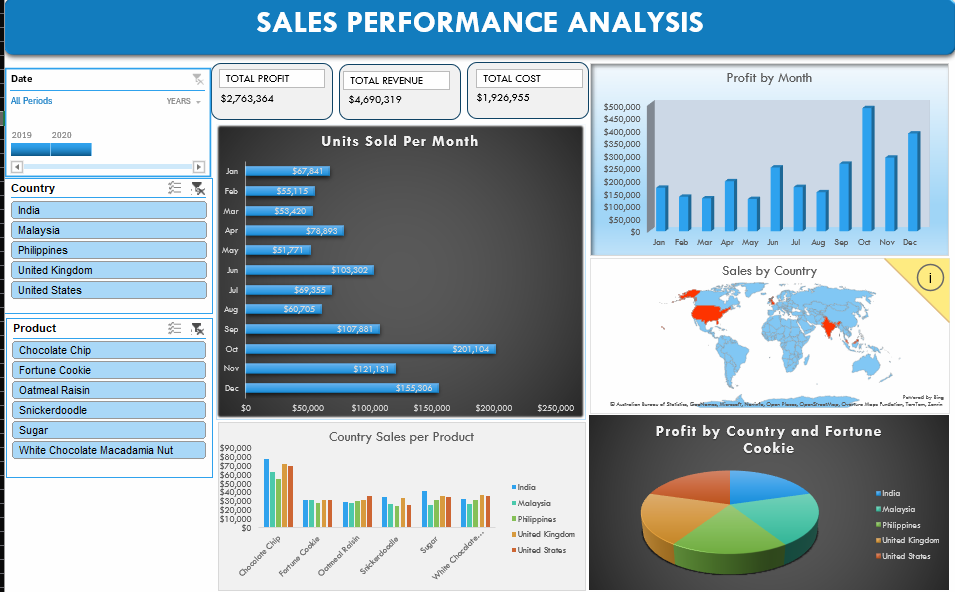
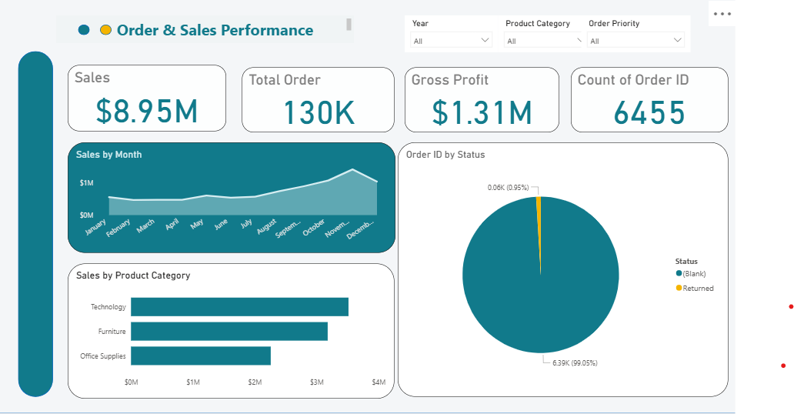

# DATA ANALYTICS PORTFOLIO
## Project 1

**Title:** [Sales Performance Analysis Dashboard](https://github.com/OluwafemiGCK/OluwafemiGCK.github.io/blob/main/SALES.png)

**Tools Used:** Microsoft Excel()

**Project Description:** 
This project involved analysing product data of cookies company to identify trends and patterns in sales performance for 2020. It is designed to provide a comprehensive overview of key performance metrics. This dashboard allows stakeholders to easily monitor and analyze the company’s performance across different regions, products, and time periods. The dashboard includes the following features:

Profit by Country and Cookies: Visual representation of profits broken down by each country and type of cookie.

Total Units Sold per Month: A monthly breakdown of the total units sold, providing insights into sales trends over time.

Profit by Month: Displays the monthly profit, allowing for easy comparison of profitability throughout the year.

Total Revenue by Country: Highlights the total revenue generated in each country, showcasing the performance in different markets.

Additionally, the dashboard includes interactive slicers and timeline for:

Month: Filter the data to view performance for a specific month or range of months.

Country: Focus on specific countries to analyze regional performance.

Product: Drill down into the performance of individual cookie products.

**Key findings:** 
Regional Profitability: Identified the most profitable countries and highlighted regions where performance could be improved.

Seasonal Trends: Revealed patterns in sales and profit that correspond with seasonal events, allowing for more strategic planning.

Top-Performing Products: Highlighted which cookie products are driving the most revenue and profit, aiding in inventory and marketing decisions.

Sales Volatility: Analyzed monthly sales fluctuations to understand market dynamics and adjust business strategies accordingly.

This dashboard serves as a crucial tool for the cookies company’s management team, providing clear, actionable insights that drive informed decision-making and strategic planning.

**Dashboard Overview:**

## Project 2
**Title:** Employee Data

**SQL Code:** [Employee Data ddl and dml](https://github.com/OluwafemiGCK/OluwafemiGCK.github.io/blob/main/employeedata.sql)

**SQL Skills Used:** 

Data Retrieval (SELECT): Queried and extraction specific information from the database.

Data Aggregation (SUM, COUNT): Calculated totals, such as sales and quantities, and counted records to analyze data trends.

Data Filtering (WHERE, BETWEEN, IN, AND): Applied filters to select relevant data, including filtering by ranges and lists.

Data Source Specification (FROM): Specified the tables used as data sources for retrieval.

Data Combination (JOINS, INNER JOIN, LEFT JOIN): Combined records from two or more tables in the database.

**Project Description:**
This project focuses on analyzing a structured dataset using SQL to extract meaningful insights related to records, dates, and data quality. The primary objective is to perform data validation, transformation, and analysis by applying key SQL functions and logical conditions.

The project involves calculating important metrics such as the number of days between two date fields (e.g., Order Date and Ship Date), which helps evaluate operational efficiency. It also includes identifying duplicate records across the entire dataset to ensure data integrity and consistency.

Additionally, conditional logic (such as IF statements and date filtering) is used to isolate records within a specific year, enabling time-based analysis and reporting. These operations support better decision-making by highlighting trends, inconsistencies, and performance indicators within the dataset.

Overall, the project demonstrates practical use of SQL for:

Data cleaning and validation
Duplicate detection
Date-based calculations
Conditional filtering and reporting

**Technology used:** SQL server

## Project 3

**Title:** [Sales & Order Analysis Dashboard](https://github.com/OluwafemiGCK/OluwafemiGCK.github.io/blob/main/ORDER.png)

**Tools Used:** Power BI ()

**Project Description:** 
This Power BI project presents an interactive dashboard designed to analyze sales and order data. It focuses on key metrics such as order trends, shipping performance, and overall sales insights. The report incorporates calculated measures (e.g., time between order and shipment), data cleaning techniques, and duplicate checks to ensure accuracy.

Users can filter data by time (e.g., specific years), explore patterns, and gain actionable insights through visualizations that support data-driven decision-making.

**Key findings:** 

**Dashboard Overview:**

